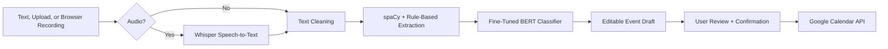

# Language Based Scheduler

A full-stack AI scheduler that turns natural language and speech into editable Google Calendar event drafts.

[](https://www.python.org/)
[](https://fastapi.tiangolo.com/)
[](https://react.dev/)
[](https://www.typescriptlang.org/)
[](https://vite.dev/)
[](https://pytorch.org/)
[](https://huggingface.co/docs/transformers)
[](https://huggingface.co/spaces)
[](LICENSE)

## Live Project

| Resource | Link |
| --- | --- |
| Live app | [Hugging Face Space](https://huggingface.co/spaces/DimasAI20/language-based-scheduler) |
| BERT checkpoint | [DimasAI20/language-based-scheduler-bert-checkpoint](https://huggingface.co/DimasAI20/language-based-scheduler-bert-checkpoint) |
| GitHub remote | `git@github.com:McDimas2005/language-based-scheduler.git` |

The app is deployed as a Hugging Face Docker Space. First requests can be slower because free Spaces may cold start and AI models may need to load into memory.

## Overview

Language Based Scheduler began as a notebook-based college NLP AOL project for creating calendar events from voice input and classifying activity type. This upgraded version turns the original idea into a portfolio-ready web application with a FastAPI backend, React/TypeScript frontend, Docker deployment, AI model health checks, and optional Google Calendar OAuth.

The core workflow is deliberately review-first: the app converts text or audio into a structured event draft, lets the user edit the title/date/time/duration/category/description, and only creates a Google Calendar event after explicit confirmation.

## Features

- Natural-language text scheduling.
- Audio scheduling from uploaded `.wav`, `.mp3`, `.m4a`, `.ogg`, and `.webm` files.
- Browser microphone recording with playback before analysis.
- Whisper `base` speech-to-text through `openai-whisper`.
- spaCy entity extraction with rule-based date/time/duration fallback parsing.
- Fine-tuned `bert-base-uncased` activity classification.
- Five activity labels: `career`, `education`, `health`, `hobby`, `social`.
- Editable event draft preview with missing-field and warning states.
- Review checkbox before Calendar creation is enabled.
- Google OAuth sign-in, account switching via `prompt=consent select_account`, and logout.
- Google Calendar event creation when OAuth is configured and connected.
- Calendar-optional demo mode for public deployments.
- Model health response for spaCy, BERT, Whisper, and Calendar configuration.
- Responsive React UI with typed API contracts.
- Single-container Docker deployment serving both frontend and backend on port `7860`.

## AI/NLP Pipeline



| Stage | What it does |
| --- | --- |
| Whisper | Transcribes uploaded or recorded audio into text. |
| Text cleaning | Normalizes the scheduling request before extraction. |
| spaCy + rules | Extracts candidate activity title, date, time, duration, and missing fields. |
| BERT classifier | Predicts one of five activity categories from the recovered legacy checkpoint. |
| Draft review | Lets the user correct fields before any external write. |
| Calendar integration | Creates a primary Google Calendar event only after OAuth and user confirmation. |

## Tech Stack

| Layer | Technology | Purpose |
| --- | --- | --- |
| Frontend | React 19, TypeScript, Vite | Scheduler workspace, typed API calls, production build. |
| UI | Tailwind CSS, Framer Motion, lucide-react | Responsive layout, motion, icons, status states. |
| Backend | FastAPI, Pydantic, Uvicorn | API routes, validation, service orchestration. |
| NLP/ML | openai-whisper, spaCy, PyTorch, Transformers, BERT | Speech recognition, extraction, classification. |
| Calendar | Google Calendar API, OAuth 2.0 | User sign-in and event creation. |
| Deployment | Docker, Hugging Face Spaces | Single public container on port `7860`. |
| Testing | pytest, FastAPI ASGI tests, TypeScript build | Backend route/service checks and frontend production build validation. |

## Architecture

```text
frontend/   React + TypeScript scheduler workspace
backend/    FastAPI API, AI services, Google Calendar integration, tests
docs/       Architecture notes, API reference, model card, deployment guide
LEGACY/     Original notebooks, project PDF, audio samples, ignored local checkpoint
scripts/    Model verification and checkpoint download helpers
```

In Docker deployment, Vite builds the frontend first. The final Python container installs the backend, downloads `en_core_web_sm`, pre-caches Whisper `base`, copies the frontend build into `/app/frontend/dist`, and FastAPI serves both:

- API routes such as `/api/analyze-text` and `/health`.
- Static frontend assets and React SPA fallback routes.

The large BERT checkpoint is not committed to GitHub or copied into the Docker build context. It is stored in a separate Hugging Face model repository and downloaded by the backend when configured.

## Screenshots

> Screenshots will be added after final UI capture from the running Hugging Face Space.

## Local Development

### Prerequisites

- Python 3.12 recommended.
- Node.js 20+ recommended.
- `ffmpeg` available on the system path.
- Git.
- Docker optional for deployment parity.

On Debian/Ubuntu:

```bash
sudo apt-get update
sudo apt-get install ffmpeg
```

### Backend

```bash
cd backend
python -m venv .venv
source .venv/bin/activate
python -m pip install --upgrade "pip<26" "setuptools==80.9.0" "wheel==0.45.1"
python -m pip install --no-build-isolation -r requirements.txt
python -m spacy download en_core_web_sm
uvicorn app.main:app --host localhost --port 8001 --reload
```

Backend URLs:

- API base: `http://localhost:8001`
- API docs: `http://localhost:8001/docs`
- Health: `http://localhost:8001/health`

### Frontend

```bash
cd frontend
npm install
npm run dev
```

Frontend URL:

- `http://localhost:5173`

During Vite development, the frontend defaults to `http://localhost:8001` for API calls unless `VITE_API_URL` is set.

## Environment Variables

Copy the example file and fill only the values needed for your mode:

```bash
cp backend/.env.example backend/.env
```

Supported backend variables include:

```env
ENVIRONMENT=local
APP_TIMEZONE=Asia/Jakarta
FRONTEND_URL=http://localhost:5173

ENABLE_GOOGLE_CALENDAR=false
GOOGLE_CLIENT_ID=
GOOGLE_CLIENT_SECRET=
GOOGLE_REDIRECT_URI=http://localhost:8001/api/auth/google/callback
GOOGLE_CALENDAR_SCOPES=https://www.googleapis.com/auth/calendar.events,openid,email,profile

LOAD_MODELS_ON_STARTUP=false
SPACY_MODEL=en_core_web_sm
WHISPER_MODEL=base
WHISPER_LANGUAGE=en

BERT_CHECKPOINT_PATH=../LEGACY/last_trained_model_checkpoint.pth
BERT_HF_REPO_ID=DimasAI20/language-based-scheduler-bert-checkpoint
BERT_HF_FILENAME=last_trained_model_checkpoint.pth
BERT_DOWNLOAD_FROM_HF=false
```

Never commit `backend/.env`, OAuth client secrets, access/refresh tokens, private keys, service account files, or local model checkpoints.

## Google Calendar OAuth Setup

Google Calendar is optional. The public demo can generate and review event drafts without Calendar credentials. To enable Calendar creation locally:

1. Create a free Google Cloud project.
2. Enable **Google Calendar API**.
3. Configure the OAuth consent screen:
   - User type: **External**
   - Publishing status: **Testing**
   - Add your Gmail account under **Test users**
4. Add these scopes:
   - `https://www.googleapis.com/auth/calendar.events`
   - `openid`
   - `email`
   - `profile`
5. Create an OAuth 2.0 Client ID:
   - Application type: **Web application**
   - Authorized JavaScript origin: `http://localhost:5173`
   - Authorized redirect URI: `http://localhost:8001/api/auth/google/callback`
6. Set `ENABLE_GOOGLE_CALENDAR=true` in `backend/.env`.
7. Copy the OAuth Client ID and Client Secret into `backend/.env`.
8. Restart backend and frontend.
9. Test sign-in, account switching, logout, draft confirmation, and event creation.

The redirect URI must exactly match `GOOGLE_REDIRECT_URI`. If the backend runs on port `8001`, do not configure Google Cloud with port `8000`.

No Google Cloud billing is required for local/demo testing.

## BERT Checkpoint

The fine-tuned BERT checkpoint is large and is intentionally stored outside GitHub.

| Item | Value |
| --- | --- |
| Model repo | [DimasAI20/language-based-scheduler-bert-checkpoint](https://huggingface.co/DimasAI20/language-based-scheduler-bert-checkpoint) |
| File | `last_trained_model_checkpoint.pth` |
| Base model | `bert-base-uncased` |
| Inference labels | `career`, `education`, `health`, `hobby`, `social` |

Development can load the checkpoint from a local path:

```env
BERT_CHECKPOINT_PATH=../LEGACY/last_trained_model_checkpoint.pth
BERT_DOWNLOAD_FROM_HF=false
```

Deployment can download it from Hugging Face Hub:

```env
BERT_HF_REPO_ID=DimasAI20/language-based-scheduler-bert-checkpoint
BERT_HF_FILENAME=last_trained_model_checkpoint.pth
BERT_DOWNLOAD_FROM_HF=true
BERT_CHECKPOINT_PATH=/app/models/last_trained_model_checkpoint.pth
```

`HF_TOKEN` is only needed if the checkpoint repository is private. Do not commit the checkpoint to GitHub.

## API Overview

| Method | Endpoint | Purpose |
| --- | --- | --- |
| `GET` | `/health` | Returns app version, environment, model availability, and Calendar status. |
| `POST` | `/api/transcribe` | Transcribes an uploaded audio file. |
| `POST` | `/api/analyze-text` | Converts text into an editable event draft. |
| `POST` | `/api/schedule-from-audio` | Transcribes audio, then returns an event draft. |
| `GET` | `/api/auth/google/status` | Reports OAuth configuration and connection state. |
| `GET` | `/api/auth/google/start` | Starts Google OAuth sign-in. |
| `GET` | `/api/auth/google/callback` | Handles Google OAuth callback and redirects to the frontend. |
| `POST` | `/api/auth/google/logout` | Clears the local OAuth token. |
| `POST` | `/api/calendar/create-event` | Creates a Calendar event from a confirmed draft when connected. |

See [docs/API_REFERENCE.md](docs/API_REFERENCE.md) for request and response examples.

## Testing

```bash
python -m compileall backend/app
cd backend && pytest
cd ../frontend && npm run build
```

The backend test suite uses the FastAPI ASGI app and service-level checks. If a local `.env` disables Google Calendar, Calendar-specific tests should set their own explicit settings rather than relying on local environment state.

## Docker and Hugging Face Spaces

The root [Dockerfile](Dockerfile) is the production deployment path for Hugging Face Spaces:

- Builds the React/Vite frontend.
- Installs Python backend dependencies with pinned packaging tools for Whisper compatibility.
- Installs `en_core_web_sm`.
- Pre-caches Whisper `base`.
- Runs FastAPI with Uvicorn on `${PORT:-7860}`.

Local Docker run:

```bash
docker build -t language-based-scheduler .
docker run --rm -p 7860:7860 \
  -e BERT_HF_REPO_ID=DimasAI20/language-based-scheduler-bert-checkpoint \
  -e BERT_HF_FILENAME=last_trained_model_checkpoint.pth \
  -e BERT_DOWNLOAD_FROM_HF=true \
  -e BERT_CHECKPOINT_PATH=/app/models/last_trained_model_checkpoint.pth \
  -e WHISPER_MODEL=base \
  -e SPACY_MODEL=en_core_web_sm \
  -e LOAD_MODELS_ON_STARTUP=true \
  -e ENABLE_GOOGLE_CALENDAR=false \
  language-based-scheduler
```

Open:

- `http://localhost:7860`
- `http://localhost:7860/health`

For Hugging Face setup details, see [docs/DEPLOYMENT_HF.md](docs/DEPLOYMENT_HF.md).

### Hugging Face deployment checklist

```bash
python -m pip install -U huggingface_hub
hf auth login

hf repos create DimasAI20/language-based-scheduler \
  --repo-type space \
  --space-sdk docker \
  --public \
  --exist-ok

hf repos create DimasAI20/language-based-scheduler-bert-checkpoint \
  --repo-type model \
  --public \
  --exist-ok

hf upload DimasAI20/language-based-scheduler-bert-checkpoint \
  <path-to-local-checkpoint>/last_trained_model_checkpoint.pth \
  last_trained_model_checkpoint.pth
```

The GitHub Actions workflow at `.github/workflows/sync-to-huggingface.yml` syncs `main` to the Docker Space. Add a GitHub Actions secret named `HF_TOKEN` with a Hugging Face write token before relying on the workflow.

Recommended Hugging Face Space variables:

```text
BERT_HF_REPO_ID=DimasAI20/language-based-scheduler-bert-checkpoint
BERT_HF_FILENAME=last_trained_model_checkpoint.pth
BERT_DOWNLOAD_FROM_HF=true
BERT_CHECKPOINT_PATH=/app/models/last_trained_model_checkpoint.pth
WHISPER_MODEL=base
SPACY_MODEL=en_core_web_sm
LOAD_MODELS_ON_STARTUP=true
APP_TIMEZONE=Asia/Jakarta
ENABLE_GOOGLE_CALENDAR=false
FRONTEND_URL=https://DimasAI20-language-based-scheduler.hf.space
```

Use Hugging Face or GitHub secret storage for private values such as `HF_TOKEN`, `GOOGLE_CLIENT_SECRET`, or any OAuth token material.

## Legacy Background

This project was originally developed as an NLP AOL college project by:

- Bintang Haidar Rabbani Pradipayasa
- Michael Dimas Chrispradipta
- Mousa Khalil Mousa Ayesh

The original notebooks focused on:

- Voice-based event creation.
- Whisper transcription.
- spaCy extraction of date/time/activity phrases.
- Fine-tuned BERT activity classification.
- Google Calendar scheduling.

The upgraded application preserves the original NLP concept while improving the project into a maintainable full-stack web app with typed frontend code, API boundaries, model health reporting, OAuth flows, Docker deployment, and deployment-safe handling for large model artifacts.

## Security and Privacy

- OAuth credentials are loaded from backend environment variables.
- Access and refresh tokens are stored locally under `backend/.tokens/` during development and are ignored by Git.
- Calendar events are created only after the user reviews and confirms the draft.
- The app requests `https://www.googleapis.com/auth/calendar.events` rather than broad Calendar account access.
- `.env`, token JSON files, private keys, service account files, and model checkpoints are excluded from Git and Docker context.
- Public demo deployments may run with Calendar creation disabled while preserving draft generation.

## Known Limitations

- Natural-language date/time extraction is conservative and may still require user edits.
- Whisper transcription quality depends on audio clarity and language/accent conditions.
- Whisper `base` and BERT run on CPU in the free Space, so cold starts and transcription can be slow.
- Free Hugging Face Spaces may sleep after inactivity.
- Google OAuth testing mode restricts sign-in to configured test users.
- The BERT classifier reflects the labels and training data from the legacy notebook, so short or ambiguous activity phrases may be uncertain.
- Recurring events, event update/delete, and persistent event history are not implemented yet.

## Future Improvements

- Recurring event support.
- Timezone selector in the frontend.
- Multilingual scheduling and language-aware transcription.
- More robust duration and recurrence parsing.
- Calendar event update/delete flows.
- OAuth permission revocation/disconnect route.
- Faster inference through model quantization or alternate ASR backends.
- Persistent user/session storage.
- Evaluation dashboard for extraction, transcription, and classification quality.
- End-to-end browser tests for the deployed workflow.

## License

This project is licensed under the [MIT License](LICENSE).

## Project Status

Language Based Scheduler is a working AI prototype and portfolio project. It demonstrates a practical path from an experimental NLP notebook to a deployed full-stack application with real ML inference, editable user-facing workflows, and deployment-aware model artifact management.
